```{r setup, include=FALSE}
options(htmltools.dir.version = FALSE)
knitr::opts_chunk$set(
  fig.width = 9, fig.height = 3.5, fig.retina = 3,
  out.width = "100%",
  cache = FALSE,
  echo = TRUE,
  message = FALSE, 
  warning = FALSE,
  hiline = TRUE
)
```

```{r xaringanExtra-share-again, echo=FALSE}
xaringanExtra::use_share_again()
```

```{r xaringan-themer, include = FALSE, warning = FALSE}
# load package
library(xaringanthemer)
# set accent theme
style_mono_accent(
  header_font_google = google_font("Nunito"),
  text_font_google = google_font("Glacial Indifference", "300", "300i"),
  code_font_google = google_font("Fira Mono"),
  base_color = "#5D7E6A",
  white_color = "#ECF5E2", 
  background_color = "#FFFFFF",
  link_color = "#F28B25", #8D5B99
  text_bold_color = "#5D7E6A",
  header_font_weight = 400,
  header_h1_font_size = "2.25rem",
  header_h2_font_size = "1.75rem",
  header_h3_font_size = "1.5rem",
  footnote_font_size = "0.7em",
)
```


class: inverse, middle

## From `r fontawesome::fa("leaf", fill = "#ECF5E2", a11y = "sem")` Ecology to `r fontawesome::fa("laptop-code", fill = "#ECF5E2", a11y = "sem")` EDS: how data science communities helped shape my career<br>

### + stick around for a gentle introduction to Quarto!

<br>

<span style = 'font-size: 130%;'>Sam Csik | Data Training Coordinator</span>  

National Center for Ecological Analysis & Synthesis<br>

<br>

<span style = 'font-size: 130%;'>Data Analysis & Coding Club | Spring 2022</span>   

Slides & source code available on [`r fontawesome::fa("github", fill = "#ECF5E2", a11y = "sem")`](https://github.com/samanthacsik/DANC-quarto)

---
### `r fontawesome::fa("grin-beam", fill = "#5D7E6A", a11y = "sem")` Hello! It's great to meet ya!

<br>
<br>

.pull-left[
```{r echo = FALSE, out.height = '100%', out.width = '100%'}
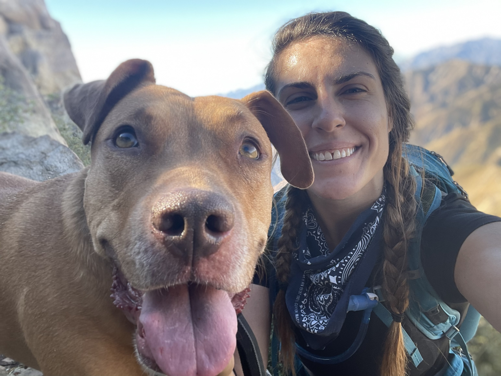
```
.center[
<span style = 'font-size: 70%; color: #868487;'>Me and my pup, Tallie</span>
]
]

.pull-right[
<br>
<br>
<span style = 'font-size: 85%;'>`r fontawesome::fa("angle-right", fill = "#5D7E6A", a11y = "sem")` Master of Ecology, Evolution & Marine Biology, UC Santa Barbara 2020</span>  
<br>
<span style = 'font-size: 85%;'>`r fontawesome::fa("angle-right", fill = "#5D7E6A", a11y = "sem")` Data Training Coordinator @ the [National Center for Ecological Analysis and Synthesis](https://www.nceas.ucsb.edu/) (NCEAS)</span>  
<br>
<span style = 'font-size: 85%;'>`r fontawesome::fa("angle-right", fill = "#5D7E6A", a11y = "sem")` Contact me at **scsik@ucsb.edu**</span>
]

<br>

.center[
<span style = 'font-size: 90%; color: #868487;'>In my spare time, I like `r fontawesome::fa("hiking", fill = "#5D7E6A", a11y = "sem")` with my `r fontawesome::fa("dog", fill = "#5D7E6A", a11y = "sem")`, `r fontawesome::fa("biking", fill = "#5D7E6A", a11y = "sem")` & `r fontawesome::fa("utensils", fill = "#5D7E6A", a11y = "sem")` cooking family meals with friends.</span>
]
---
### `r fontawesome::fa("university", fill = "#5D7E6A", a11y = "sem")` Grad school - came for the field work, left for the data science

.pull-left[
<br>
<br>
<span style = 'font-size: 85%;'>`r fontawesome::fa("angle-right", fill = "#5D7E6A", a11y = "sem")` Research question: How does temperature alter the physiology and foraging ecology of CA spiny lobster?</span>  
<br>
<span style = 'font-size: 85%;'>`r fontawesome::fa("angle-right", fill = "#5D7E6A", a11y = "sem")` Was *terrified* of all things R/data-related prior to taking [ESM 206](https://github.com/allisonhorst/esm-206-2018) & 244 with [Dr. Allison Horst](https://www.allisonhorst.com/) in 2018</span>  
<br>
<span style = 'font-size: 85%;'>`r fontawesome::fa("angle-right", fill = "#5D7E6A", a11y = "sem")` Gained skills and confidence through coding communities (e.g. [R-Ladies SB](https://www.meetup.com/rladies-santa-barbara/), [UCSB TidyTuesday Coding Club](https://www.ucsbtidytuesday.com/)) & collaborative learning (e.g. working through [R for Data Science](https://r4ds.had.co.nz/) with An Bui!)</span>  
]

.pull-right[
```{r echo = FALSE, out.height = '80%', out.width = '80%'}
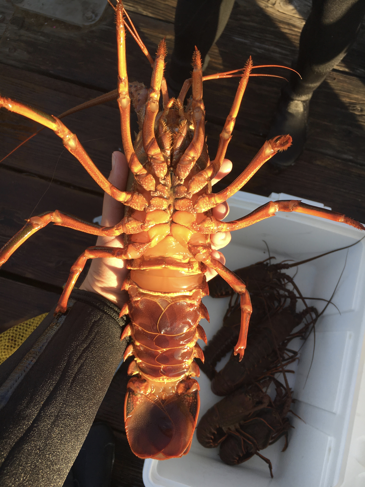
```
.center[
<span style = 'font-size: 70%; color: #868487;'>A California spiny lobster (*Panulirus interruptus*), caught off Stearns Wharf</span>
]
]

---
### `r fontawesome::fa("people-carry", fill = "#5D7E6A", a11y = "sem")` R-Ladies Santa Barbara - working to promote diversity in the R community

.center[
> <span style = 'font-size: 70%;'>“R-Ladies makes it ok to have a **positive, supportive culture to learn**, and that’s something we don’t by default have in science. It has dislodged the status quo for me. **It doesn’t have to be intimidating to ask questions. It doesn’t have to be scary to even show up**.”</span> <span style = 'font-size: 60%; color: #868487;'>- *Julie Lowndes, co-founder R-Ladies SB*</span></span>
]

.pull-left[
```{r echo = FALSE, out.height = '120%', out.width = '120%'}
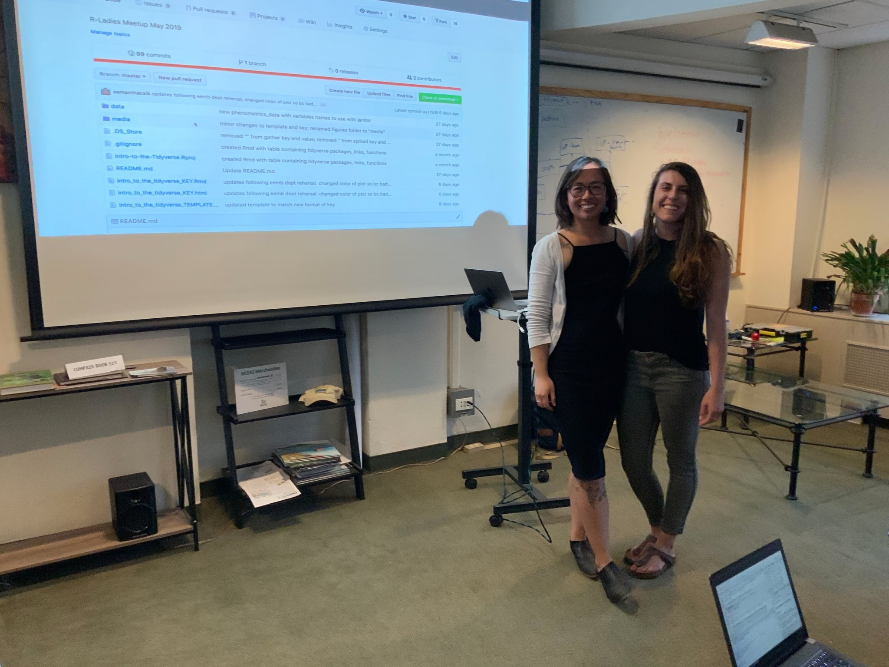
```
.center[
<span style = 'font-size: 70%; color: #868487;'>An Bui & I just before leading our first R-Ladies SB meetup, [Intro to the {tidyverse}](https://samanthacsik.github.io/talks/2022-04-20-intro-to-the-tidyverse/) just a few months after beginning to learn `r fontawesome::fa("r-project", fill = "#868487", a11y = "sem")`</span>
]
]

.pull-right[
<br>
<span style = 'font-size: 85%;'>`r fontawesome::fa("angle-right", fill = "#5D7E6A", a11y = "sem")` Member since 2018, co-organizer since 2020</span>  
<br>
<span style = 'font-size: 85%;'>`r fontawesome::fa("angle-right", fill = "#5D7E6A", a11y = "sem")` ~5 events/year that cover a variety of topics with a mixed range of difficulty levels</span>  
<br>
<span style = 'font-size: 85%;'>`r fontawesome::fa("angle-right", fill = "#5D7E6A", a11y = "sem")` Join us on [`r fontawesome::fa("meetup", fill = "#F28B25", a11y = "sem")` Meetup](https://www.meetup.com/rladies-santa-barbara/)</span>  
<br>
<span style = 'font-size: 85%;'>`r fontawesome::fa("angle-right", fill = "#5D7E6A", a11y = "sem")` Follow us on [`r fontawesome::fa("twitter", fill = "#F28B25", a11y = "sem")` Twitter](https://twitter.com/rladiessb)</span>  
<br>
<span style = 'font-size: 85%;'>`r fontawesome::fa("angle-right", fill = "#5D7E6A", a11y = "sem")` Access event materials on [`r fontawesome::fa("github", fill = "#F28B25", a11y = "sem")` GitHub](https://github.com/rladies/meetup-presentations_santabarbara)</span>  
<br>
<br>
]

---
### `r fontawesome::fa("database", fill = "#5D7E6A", a11y = "sem")` NCEAS data fellowship - gaining data science skills with a cohort of early career researchers

<br>

.pull-left[
<br>
<span style = 'font-size: 85%;'>`r fontawesome::fa("angle-right", fill = "#5D7E6A", a11y = "sem")` 1 year-long data fellowship with the [Arctic Data Center](https://arcticdata.io/) @ NCEAS - more info [here](nceas.ucsb.edu/fellowships/data-science-fellowship-program)</span>  
<br>
<span style = 'font-size: 85%;'>`r fontawesome::fa("angle-right", fill = "#5D7E6A", a11y = "sem")` Built controlled vocabularies and semantically annotated data sets to make data more findable and reusable</span>  
<br>
<span style = 'font-size: 85%;'>`r fontawesome::fa("angle-right", fill = "#5D7E6A", a11y = "sem")` Want to learn more about semantics? Check out this [3 minute lightening talk](https://docs.google.com/presentation/d/10HNe2u-QrtPOTk1G9FdmtBy779HmVlrNC2Nk_-YWEXc/edit#slide=id.gc27e9dd32a_1_20) given during a [SB Women in STEM](https://www.sbwomeninstem.org/) event, spring 2021 (spoken script included as presenter notes)</span>  
<br>

]

.pull-right[
<br> 
<br>
<br>
```{r echo = FALSE, out.height = '75%', out.width = '75%'}
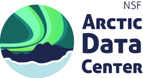
```
]

---
### `r fontawesome::fa("laptop-code", fill = "#5D7E6A", a11y = "sem")` NCEAS + MEDS - learning & teaching data science with colleagues and students

.pull-left[
```{r echo = FALSE, out.height = '95%', out.width = '95%'}
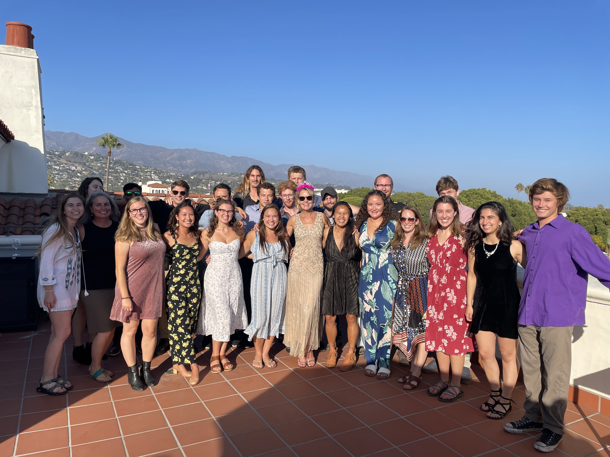
```
.center[
<span style = 'font-size: 60%; color: #868487;'>MEDS class of 2022 during an NCEAS terrace happy hour</span>
]
]

.pull-right[
```{r echo = FALSE, out.height = '100%', out.width = '100%'}
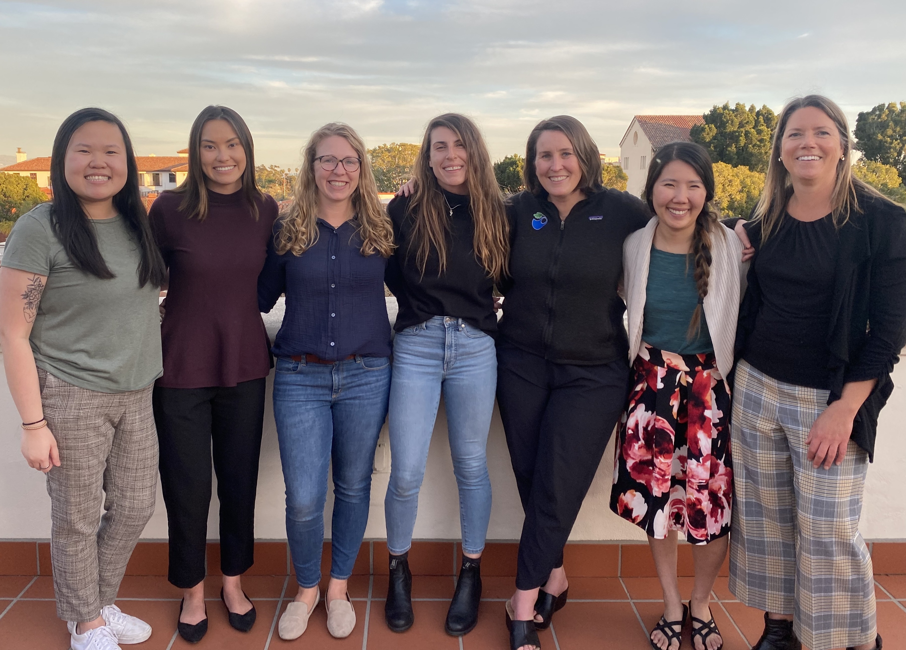
```
.center[
<span style = 'font-size: 60%; color: #868487;'>Core MEDS staff - learn more about us [here](https://ucsb-meds.github.io/meds-contacts.html)!</span>
]
]

<span style = 'font-size: 80%;'>`r fontawesome::fa("angle-right", fill = "#5D7E6A", a11y = "sem")` 11-month professional master's program, administered by [Bren](https://bren.ucsb.edu/masters-programs/master-environmental-data-science) in partnership with NCEAS</span>  
<br>
<span style = 'font-size: 80%;'>`r fontawesome::fa("angle-right", fill = "#5D7E6A", a11y = "sem")` Coursework includes scientific programming, ML, remote sensing, spatial analysis, data viz, and more </span>  
<br>
<span style = 'font-size: 80%;'>`r fontawesome::fa("angle-right", fill = "#5D7E6A", a11y = "sem")` 6-month group capstone project - come watch the Class of 2022 present on May 26! Info [here](https://bren.ucsb.edu/events/2022-meds-capstone-project-presentations)</span>  
<br>
<span style = 'font-size: 80%;'>`r fontawesome::fa("angle-right", fill = "#5D7E6A", a11y = "sem")` Find workshops materials on the [MEDS website for current students](https://ucsb-meds.github.io/workshops.html)</span>  
<br>

---
class: inverse, middle, center

## Enough about me...let's chat Quarto!

Do you already love RMarkdown? Then Quarto might just be your new best friend.

---
### `r fontawesome::fa("question", fill = "#5D7E6A", a11y = "sem")` Quarto - what even is it?

<span style = 'font-size: 80%;'>[Quarto](https://quarto.org/) is a publishing tool built on Pandoc (just like RMarkdown). *However*, unlike RMarkdown, it's purposefully built to support multiple languages (R, Python, Julia, Observable JS) and includes lots of exciting new features and capabilities.</span>

.center[
```{r echo = FALSE, out.height = '80%', out.width = '80%'}
knitr::include_url("https://quarto.org/")
```
]

.center[
<span style = 'font-size: 80%;'>To get started, download and [install Quarto](https://github.com/quarto-dev/quarto-cli/releases/download/v0.9.405/quarto-0.9.405-macos.pkg) and update RStudio to [version v2022.2](https://rstudio.com/products/rstudio/download/).
</span>
]

---
class: inverse, middle, center

### Let's move over to RStudio to demonstrate some of the fun new features available when working with Quarto documents. 

You can follow along by opening up RStudio on your own computer, or check out the following slides, which detail some of what I'll demonstrate. You can also check out the [quarto_key.qmd]() file, which includes examples of all the features we'll cover today. 

ADD LINK TO KEY

---
### `.Rmd` and `.qmd` files still look very similar

.pull-left[
```{r echo = FALSE, out.height = '100%', out.width = '100%'}
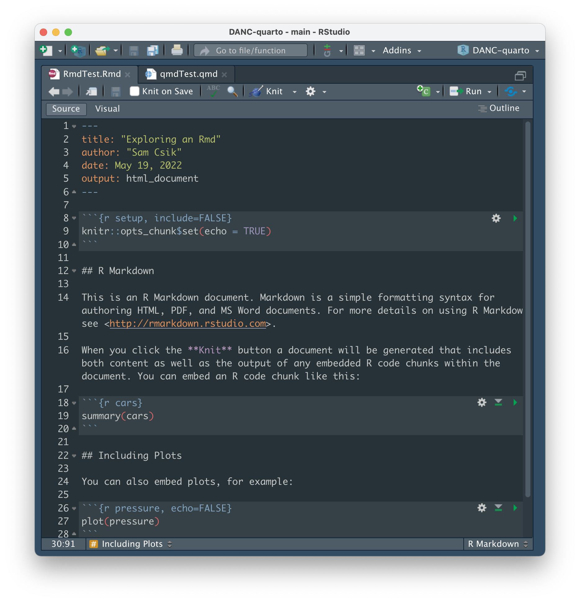
```
]

.pull-right[
```{r echo = FALSE, out.height = '100%', out.width = '100%'}
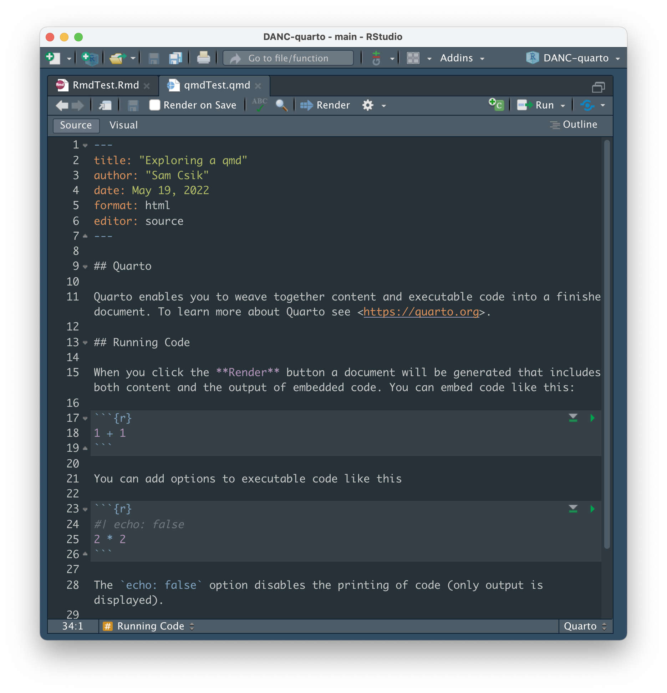
```
]

.center[
<span style = 'font-size: 80%;'>**Note:** By default, the `.qmd` file YAML specifies `editor: visual`. If you prefer the source editor as your default, update the YAML as `editor: source`.</span>
]

---
class: inverse, middle, center

## Some notable differences

---
### Render, not knit

<span style = 'font-size: 80%;'>You'll see the  button, rather than 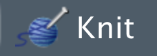 at the top of your `.qmd` file.</span>

.pull-left[
```{r echo = FALSE, out.height = '100%', out.width = '100%'}
knitr::include_graphics("media/renderedRmd.png")
```
]

.pull-right[
```{r echo = FALSE, out.height = '100%', out.width = '100%'}
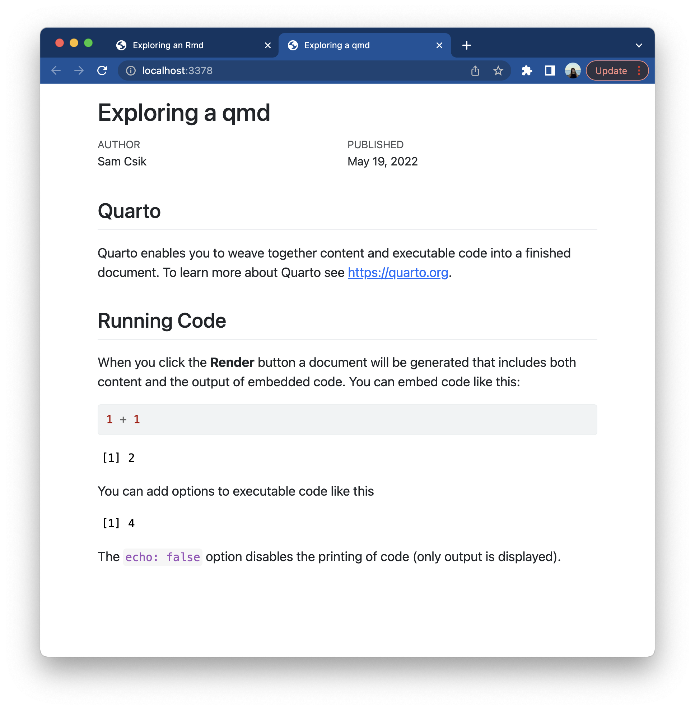
```
]

.center[
<span style = 'font-size: 80%;'>Rendered `.qmd` documents have a bit more "modern" feel to them.</span>
]

---

### Global options now live in the YAML header (goodbye `knitr` setup chunk!)

<span style = 'font-size: 80%;'>For example, to prevent code (but not the results) from appearing in your rendered file as the default, specify `echo: true` in the YAML header of your `.qmd` file:</span>

```{r eval = FALSE}
---
title: "My quarto doc title"
execute:
  echo: true
---
```

<span style = 'font-size: 80%;'>rather than including a `knitr` setup chunk at the top of your `.Rmd` file, just after the YAML:</span>

```{r eval = FALSE}
knitr::opts_chunk$set(echo = TRUE)
```

---
### Introducing chunk options as YAML using the hash pipe, `#|`

<span style = 'font-size: 80%;'>The hash pipe, `#|`, now works in `.Rmd` files as well! It looks something like this:</span>

```{}
#| echo: false
#| fig-cap: "Here is my figure caption"
#| fig-alt: "Here is my very long alt text for my rendered figure"
ggplot(...) +
  geom_point()
```

<span style = 'font-size: 80%;'>as opposed to:</span>

```{}
{r, echo = FALSE, fig.cap = "Here is my figure caption", fig.alt = "Here is my very long alt text for my rendered figure"}
ggplot(...) +
  geom_point()
```

<span style = 'font-size: 80%;'>**Also note some additional changes:**</span>

<span style = 'font-size: 70%;'>`r fontawesome::fa("angle-right", fill = "#5D7E6A", a11y = "sem")` we now use `:` rather than `=`, and booleans are lowercase (e.g. `echo: true` rather than `echo = TRUE`)</span>  

<span style = 'font-size: 70%;'>`r fontawesome::fa("angle-right", fill = "#5D7E6A", a11y = "sem")` use kebab-case for all YAML keys and to delimit figure/layout/code chunk options (e.g. `fig-alt` rather than `fig.alt`)</span>  

---
class: inverse, center, middle

## Okay, this all seems cool, but I'm comfortable where I'm at right now...do I need to switch??

Short answer: not unless you want to!  

Check out [this post](https://yihui.org/en/2022/04/quarto-r-markdown/) by Yihui Xie for some further insight.

---
### Want to learn more?

<span style = 'font-size: 80%;'>Come hang with us as we chat about all things Quarto with [Dr. Julie Lowndes](https://jules32.github.io/), Founder and Co-Director of [Openscapes](https://www.openscapes.org/). We'll be joined by members of the [NASA Openscapes Champions Cohort](https://nasa-openscapes.github.io/), who will share their experiences using Quarto to enable data-intensive open science.</span>

<span style = 'font-size: 80%;'>Find more information on the [R-Ladies Santa Barbara Meetup page](https://www.meetup.com/rladies-santa-barbara/events/285849847/) and register on [Eventbrite](https://www.eventbrite.com/e/hello-quarto-tickets-337618986477)!</span>

.center[
```{r echo = FALSE, out.height = '70%', out.width = '70%'}
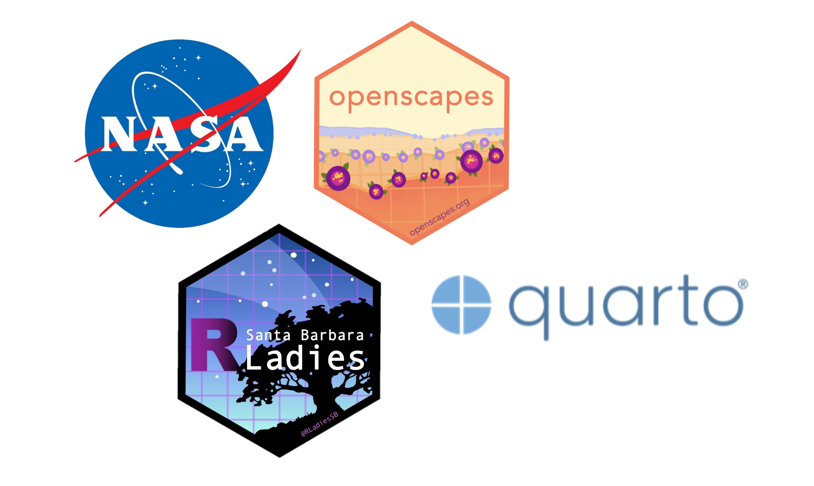
```
]

---
### In the meantime, check out these other great resources!

<span style = 'font-size: 85%;'>`r fontawesome::fa("angle-right", fill = "#5D7E6A", a11y = "sem")` [We don't talk about Quarto](https://www.apreshill.com/blog/2022-04-we-dont-talk-about-quarto/), by Alison Hill</span>  
<br>
<span style = 'font-size: 85%;'>`r fontawesome::fa("angle-right", fill = "#5D7E6A", a11y = "sem")` [Notes on Changing from RMarkdown/Bookdown to Quarto](https://www.njtierney.com/post/2022/04/11/rmd-to-qmd/), by Nicholas Tierney</span>  
<br>
<span style = 'font-size: 85%;'>`r fontawesome::fa("angle-right", fill = "#5D7E6A", a11y = "sem")` [Reproducible authoring with Quarto](https://www.youtube.com/watch?v=6p4vOKS6Xls&t=67s) (recorded talk), by Mine Çetinkaya-Rundel</span>  
<br>
<span style = 'font-size: 85%;'>`r fontawesome::fa("angle-right", fill = "#5D7E6A", a11y = "sem")` [Quarto for Scientists](https://github.com/njtierney/qmd4sci) (still under construction! but be sure to check back), by Nicholas Tierney</span>

